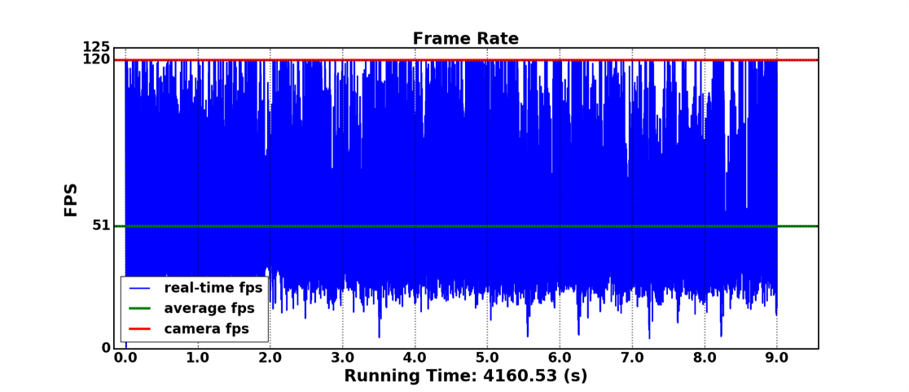

# Smooth FaceRecognition

---

The project is a face recognition system with face-detection, anti-spoof detection and face recognition.

It can be deployed to *Windows, Linux, and Nvidia Jetson (arm architecture)* devices.

Our Anti-Spoofing and face recognition refer to 
**minivision-ai/Silent-Face-Anti-Spoofing**
and 
**ageitgey/face_recognition**.

However, most open source face recognition projects do not have enough **fluency**. 
This project uses multi-threading and some model improvement methods to make the system output frame rate **exceed 45fps**.

Everyone can easily use the system in _**small indoor projects or course experiments**_. Welcome to **star** and collaborate.

## FPS on Nvidia Jetson


## Running Time for Each Part
Part | Face-Detection | Anti-Spoofing | Face Recognition | Output |
---- | ---- | ---- | ---- | ---- |
Time | 0.0552 | 0.0770 | 0.0349 | 0.0010 |

---

## Install Environment
### (on x86 device)
```
pip install -r requirements.txt
```
### (on arm device)
Notice: Install ```pytorch``` from https://forums.developer.nvidia.com/t/pytorch-for-jetson-version-1-9-0-now-available/72048
and ```torchvision``` in similar way.
## Clone
```
git clone https://github.com/ojipadeson/faceRecognition
```

---
## Store some photos
In order to recognize you, store some of your photos (>=1) into ```/face``` directory,
and name as :
```
/face
   your_name00.jpg
   your_name01.jpg
   ...
   # similar for other people
   David00.jpg
   Selina00.jpg
   Selina01.jpg
   ...
```
## Preprocessing
```
python face_process.py
```
## Run
```
python test.py
```
## Optional Arguments(Can Skip)
```-h``` help command

---

```-r``` record every frame of the output video when the system is running

---

```-n``` set a simple logic that we gather *n* images' information before coming to a prediction for Anti-Spoofing

```-c``` the confidence threshold for above logic. 

For example, ```-c 0.8 -n 10``` means when over 8 of 10 pictures are tested alive 
then the system will give the result **True Face**.
Similarly, **Fake Face** will be given when over 8 of 10 pictures are tested Fake
If the result don't belong to above 2 situation, video stream will show *Considering...*

---

```-p``` when result is neither surely real nor surely fake for a relatively long time, 
it's very possible that the system is under attack. With this command, 
system will **lock** when samples are difficult to predict

---

```-t``` the tolerance threshold for face recognition.
When face distance is above this threshold,
the system will treat it as *Unknown Face*

---

```-f``` show fps on the video output, and give a plot for fps at all time after system exit

```-m``` show the running time(s) of every part of the system after exit

---

Concrete usages are as follows:

```
usage: test.py [-h] [-r] [-p] [-n NUMBER] [-c CONFIDENCE] [-t TOLERANCE] [-f]
               [-m]

optional arguments:
  -h, --help            show this help message and exit
  -r, --record          record the video
  -p, --protect         protect system from difficult samples
  -n NUMBER, --number NUMBER
                        number of test time for one face
  -c CONFIDENCE, --confidence CONFIDENCE
                        minimal confidence for multi-test
  -t TOLERANCE, --tolerance TOLERANCE
                        tolerance for minimal face distance
  -f, --fps             record frame rate
  -m, --monitor         monitor every part's performance
```
## System Exit
1. Video Windows On Top
2. Press ```Q```

* If you enable system protection by command ```-p``` or ```--protect```,
  and encounter system lock(screen grayed out), press ```-p``` to unlock

* If not exit immediately, try pressing several more times

---
